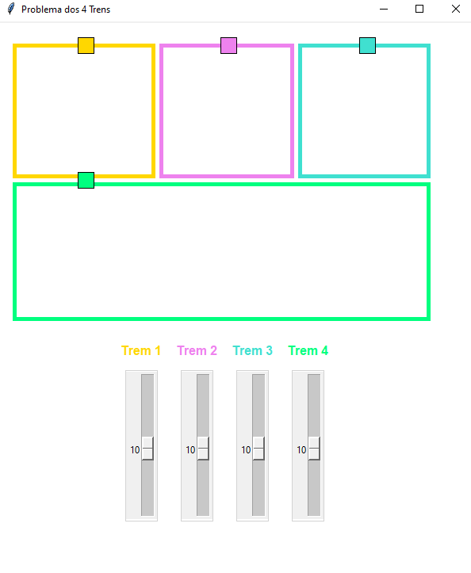

# 🚂 Projeto: Problema dos 4 trens

Cada trem se move em trajetórias específicas, percorrendo trilhos compartilhados. Entretanto, deve-se ter o cuidado ao gerenciar acesso aos trilhos, garantindo que apenas um trem utilize um segmento compartilhado por vez, utilizando principios de programação concorrente, a exclusão mútua (mutex).

Neste projeto podemos ajustar a velocidade dos trens utilizando uma interface gráfica com controles deslizantes.


|Interface Dinâmica (Tkinter)|
|:-:|
||


## 🔗 Execução do Projeto
``` py
python main.py
```
```
pyhton3 main.py
```

## 📌 Autora
◽ [Quelita Míriam](https://github.com/quelita2)

---
<div align="center">
  📚 DCA0125 - <strong> SISTEMAS DE TEMPO REAL </strong> - T01 (2024.2 - 24T34) 🎓 <br/>
  Universidade Federal do Rio Grande do Norte - Departamento de Computação e Automação (DCA). 🏛️
</div>