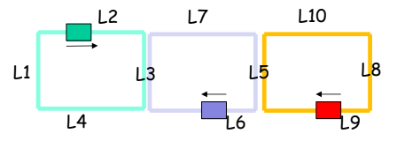

# 🚆 **Problema dos Trens - Concorrência com Mutex**

Este projeto simula **trens concorrentes** utilizando a biblioteca **Pthreads** em C++. O objetivo é garantir que múltiplos trens possam operar em trilhos compartilhados **sem colidir**, utilizando **mutex** para controlar o acesso aos recursos compartilhados (trilhos).

| Descrição do problema dos trens |
|:-:|
||

## 🧩 **Solução**

Cada trem é executado em uma thread separada, funcionando em um loop infinito (`while (1)`).

O **mutex** garante que apenas um trem possa acessar o trilho compartilhado (**L3** ou **L5**) por vez.

Um **mutex extra** é usado para proteger a saída no terminal e evitar sobreposição de mensagens.

### **Saída do Programa**
O programa exibirá uma tabela no terminal, mostrando o estado dos trens em tempo real:

```
| Trem      | Seção Atual | Mutex L3 | Mutex L5 |
|-----------|-------------|----------|----------|
| Verde     | L1 -> L2    | Livre    | Livre    |
| Roxo      | L6          | Livre    | Livre    |
| Vermelho  | L8          | Livre    | Livre    |

| Trem      | Seção Atual | Mutex L3 | Mutex L5 |
|-----------|-------------|----------|----------|
| Verde     | L3          | Ocupado  | Livre    |
| Roxo      | L6          | Ocupado  | Livre    |
| Vermelho  | L8          | Livre    | Livre    |

| Trem      | Seção Atual | Mutex L3 | Mutex L5 |
|-----------|-------------|----------|----------|
| Verde     | Saindo L3   | Livre    | Livre    |
| Roxo      | L3          | Ocupado  | Livre    |
| Vermelho  | L8          | Livre    | Livre    |
```

## 📂 **Estrutura do Código**

O código está estruturado da seguinte maneira:

- **Mutex**:
  - Um mutex para o **trilho L3**.
  - Um mutex para o **trilho L5**.

- **Funções dos Trens**:
  - Cada trem é representado por uma thread separada.
  - Os trens acessam as seções compartilhadas utilizando **`pthread_mutex_lock`** e **`pthread_mutex_unlock`** para garantir exclusão mútua.

## 🚦 **Compilação e Execução do Programa**

### **Requisitos**
- Compilador **GCC**.
- Ambiente que suporte **pthreads**.

### **Compilação**
Use o seguinte comando para compilar o código:

```bash
g++ -o tarefa2 tarefa2.c -lpthread
```

### **Execução**
Após compilar, execute o programa com o comando:

```bash
./tarefa2
```

---
<div align="center">
  📚 DCA0125 - <strong> SISTEMAS DE TEMPO REAL </strong> - T01 (2024.2 - 24T34) 🎓 <br/>
  Universidade Federal do Rio Grande do Norte - Departamento de Computação e Automação (DCA). 🏛️
</div>