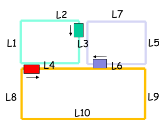

# 🚆 **Evitando Deadlock em Programação Concorrente**

Este projeto tem como objetivo resolver um problema de **programação concorrente** em um sistema de controle de trens que compartilham seções críticas de uma ferrovia. O desafio é **evitar colisões**, garantindo que apenas um trem ocupe uma seção crítica por vez, além de **prevenir deadlock** ao evitar que os trens fiquem bloqueados indefinidamente esperando uns pelos outros.

| Descrição do problema dos trens |
|:-:|
||

## 🧩 **Solução**

A solução utiliza **mutexes** (exclusão mútua) para controlar o acesso às seções críticas. Cada trem é representado por uma **thread**, e as seções críticas são protegidas por **mutexes**. 

- **L3**: Mutex para seção L3.
- **L4**: Mutex para seção L4.
- **L6**: Mutex para seção L6.

Os trens "travam" o mutex ao entrar em uma seção crítica e "liberam" o mutex ao sair, garantindo que não haja colisões.

### **Saída do Programa**

O programa imprimirá continuamente o estado dos trens e dos mutexes em uma tabela, atualizada em tempo real.

```
| Trem      | Seção Atual | Mutex L3 | Mutex L4 | Mutex L6 |
|-----------|-------------|----------|----------|----------|
| Verde     | L3          | Ocupado  | Livre    | Livre    |
| Roxo      | L5          |          |          |          |
| Vermelho  | L8          |          |          |          |
```

- **Trem**: Identificação da cor do trem
- **Seção Atual**: Localização atual do trem
- **Mutexes**: Estado das seções críticas (Livre ou Ocupado)

## 📂 **Estrutura do Código**

- **Threads**: Representam os trens em execução simultânea.
- **Mutexes**: Garantem a exclusão mútua nas seções críticas.
- **Função de Monitoramento**: Imprime o estado dos trens e dos mutexes.

## 🚦 **Compilação e Execução do Programa**

### **Requisitos**
- Compilador **GCC**.
- Ambiente que suporte **pthreads**.

### **Compilação**
Use o seguinte comando para compilar o código:

```bash
g++ -o tarefa2 tarefa2.cpp -lpthread
```

### **Execução**
Execute o programa compilado com:

```bash
./tarefa2
```

---
<div align="center">
  📚 DCA0125 - <strong> SISTEMAS DE TEMPO REAL </strong> - T01 (2024.2 - 24T34) 🎓 <br/>
  Universidade Federal do Rio Grande do Norte - Departamento de Computação e Automação (DCA). 🏛️
</div>